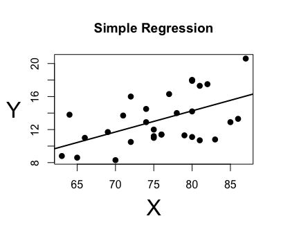
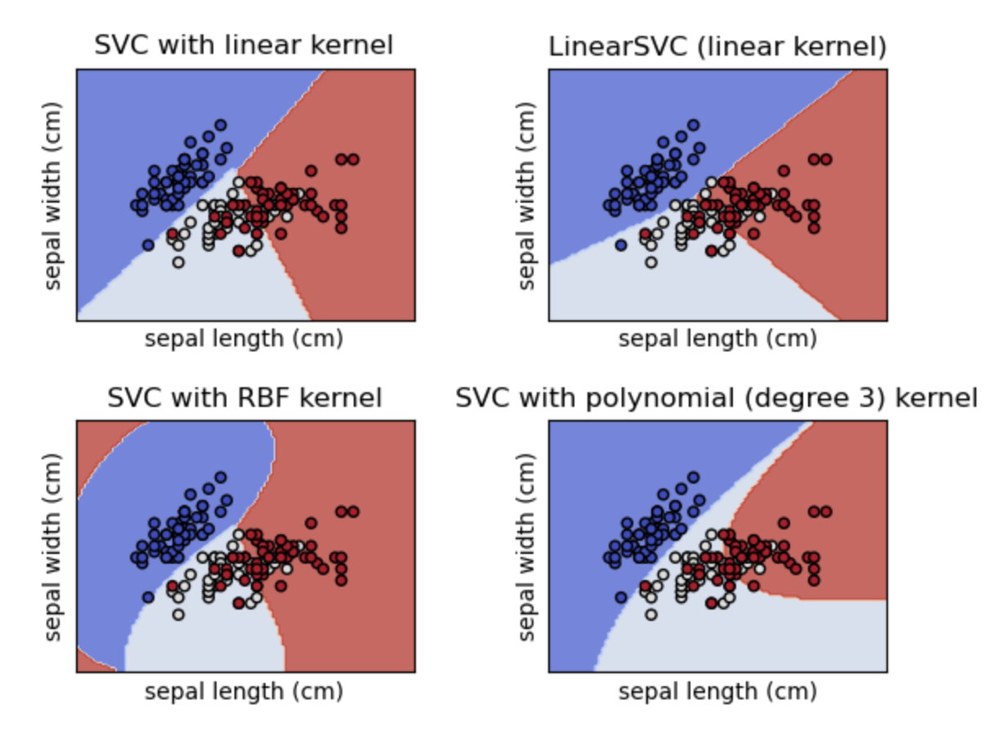
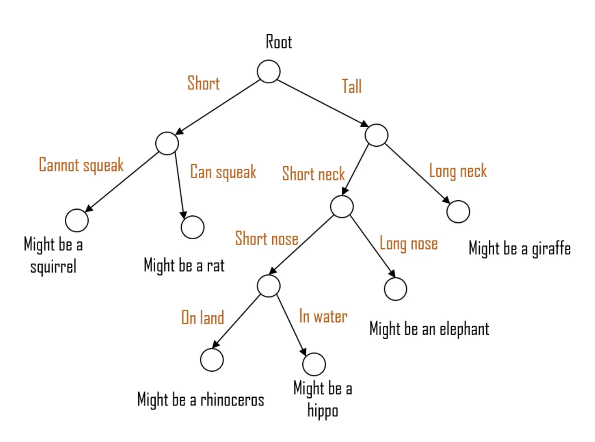
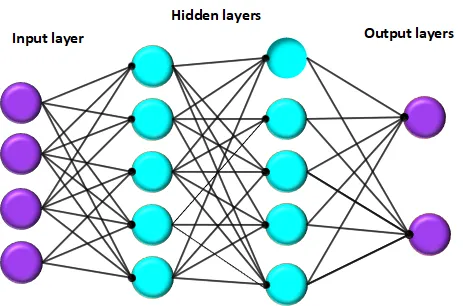
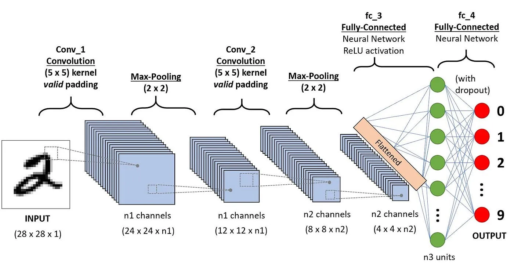
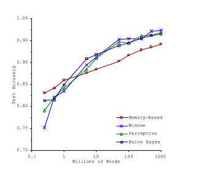
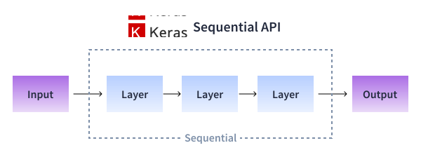
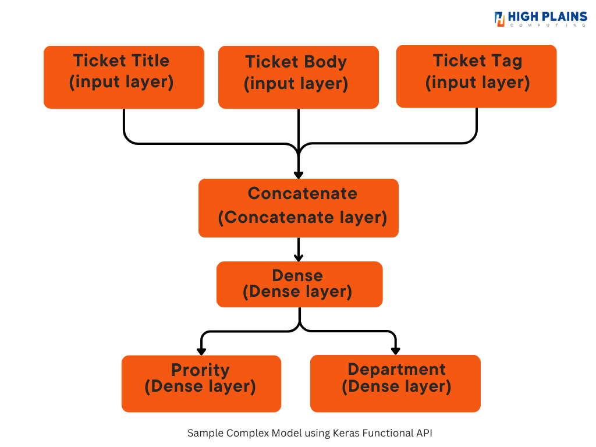

f
# Machine Learning Algorithm category

| Category        |  Explain  | Scenarios           |
| ------------- |:-------------:|----------|
| Supervised Learning | Training data is labeled | Auto Driving   Image Recognization |
| UnSupervised Learning | Training Data is not labeled | Clustering   Anomaly detection   Dimensionality Reduction |
| Semi-Supervised Learning | Trained on labeled and unlabeled data | self-training   co-training |
| Reinforcement Learning | Adjust according to feedback to gain maximum reword | game playing   Reward such as Finance   natural language process |

# Machine Learning Algorithms

| Name          |  Category     | Detail        | Scenarios  |
| ------------- |:-------------:|:-------------|-----------|
| Linear Regression | Supervised | Continous Regression Line |  |
| Logistic Regression | Supervised | Yes - No | Binary Classification   Medication Dignosis   Political Forecasting |
| Naive Bayes |  Supervised | Based on Bayes-theory | |
| Decision Tree | Supervised | Decision boundary is when the possibility is equal for both side in 1-0 scenario   Classification error, Gini and Entropy to meaure the algorithm   stopping condition|
| Random Forest | Supervised | Use a set of sub-forest to vote | Robost, default for many scenarios |
| KNN - K-Nearest Neighbor | Unsupervised | Use the K nearst neighbor to decide where it belongs | classification |
| K-means | Unsupervised | Use a 'center' to define each cluster | Clustering |
| SVM - Supported Vector Machine | Supervised |  | Classification and regression |
| XGBoost | Supervised | Large dataset,  complex problems | classification   Regression   Feature selecion   abnormal detection   natural language processing   feature selection |
| CNN Convolutional Neural Networks | Supervised, Deep Learning |  | Image Classification   Object Detection   Image Segmentation |
| RNN - Recurrent Neural Networks | Supervised, Deep Learning| | Sequential Data Processing   Time series preication  Speech Recognition |
| GAN - Generative Adversarial Network | Supervised, unsupervised, Deep Learning | | Image Generation   Image to image translation   abormal detection |
| Deep Belief Network | UnSupervised, Deep Learning | |
| Autoencoders | Unsupervised, Deep Learning | | data denoising   dimensionality reduction   anomaly detection |
| DRL  - Deep Reinforcement Learning | Reinforcement, Deep Learning | Combining deep learning with reinforcement learning | Feature Learning   |
| Transformer Network | Semi-supervised, Deep Learning |  | Natural Language Processing, including BERT, GPT | 
| Yolo - You only look once | Supervised, Deep Learning | | Real time object detection   Traffic Monitoring   Retail Analysis |

# Popular Machine Learning library

| Library          |  Short Description     |
| ------------- | ----------- |
| Scikit-Learn | Traditional Machine Learning Algorithms, such as XGBoost |
| TensorFlow | Deep Learning Framework, Google backed |
| Pytorch | Deep Learning Framework, Facebook backed |
| Keras | Deep Learning Library, Popular choice and supported multiple platform |
| Numpy | Numeric computing  |
| Matplotlib | Visualize 2-D data |
| Pandas | Read and Analysis structured data |
| dtreeviz | A python library to visualize deep-tree process in details |

# Machine Learning in Chart
### Linear Regression 
* supervised
* continous regression line

### SVM
* Can be used for both linear and non-linear scenario
* Maximum the distance(margin) between different classes

### KNN
* Unsupervised - no need to train
* Use the K nearst neighbor to decide where it belongs

### K-means
* Unsupervised
* Use a ‘center’ to define each cluster

### Decision Tree
* Decision boundary is when the possibility is equal for both side in 1-0 scenario
* Classification error, Gini and Entropy to meaure the algorithm stopping condition

### Random Forest
* creates multiple subsets
* trained with a random subset of features to get trees
* each tree votes(majority vote or average prediction) to get the result

### XGBoost
* Gradient Boosting - each model is build on the error of the previous models
* It uses decision tree as the base learner

### Gradient Boost Algorithms

| Name          | Detail  | Scenarios  | Developer |
| ------------- |:-------------:|:-------------|-----------|
| XGBoost | optimized distributed gradient boosting library | many scenarios, default choice | XGBoost.ai |
| LGBM | tree based learning algorithms | Large Dataset, high performace | Microsoft|
| CatBoost | Decision tree based boost framework | search, recommendation systems, personal assistant, self-driving cars, weather prediction | Yondex|

## Deep Learning - Neural Network

### ANN
* This is the most basic type of neural network, often referred to as a feedforward neural network
* Suitable for problems where input features are independent and don't depend on the sequence or spatial relationships (e.g., tabular data, classification tasks)
* https://www.superdatascience.com/blogs/the-ultimate-guide-to-artificial-neural-networks-ann

### CNN
* Designed specifically for processing grid-like data, such as images
* Primarily used in image processing, computer vision
* https://www.superdatascience.com/the-ultimate-guide-to-convolutional-neural-networks-cnn/

### RNN
* Designed for processing sequential data or data with order
* Suitable for tasks involving sequences, such as speech recognition, language translation, text generation, and time series forecasting
* https://www.superdatascience.com/blogs/the-ultimate-guide-to-recurrent-neural-networks-rnn

# Importance of data versus algorithms

# Popular Encoder - from text to numeric

| Name          | Detail  | Scenarios  |
| ------------- |:-------------:|-----------|
| LabelEncoder  | Convert category data into a number, like 2 | Quick   Preserver the order |
| OneHotEncoder | Convert category data into a binary vector such as [0,0,1]| Doesn't assume the order   Can handle unseen label |
| Binary Encoder | Convert category data into a binary vector such as [0,0] [0,1], [1,1] | has less dimensionality compared to one-hot-code |
| Target Encoder (Mean-Encoder) | Encode category data by the mean value of each category | Useful when there is strong relation between category and target variable |
| Frequency Encoder | Encodes each category by its frequency | Useful when frequency is a valuable feature |

# Real Datasets
* OpenML.org - openml.org
* Kaggle.com - kaggle.com/datasets
* PapersWithCode.com - paterswithcode.com/datasets
* UC Irvine Machine Learning Repository - archive.ics.uci.edu/ml
* Amazon's AWS datasets - registry.opendata.aws
* TensorFlow datasets - tensorflow.org/datasets

# Keras Model
## Sequential Model

## Functional Model

# Visualliization Tool
* Matplotlib
* TensorBoard - TensorFlows's visulization tool

# ChatGPT
* How does chatGPT works - https://writings.stephenwolfram.com/2023/02/what-is-chatgpt-doing-and-why-does-it-work/
* Deepseek V3 source code - https://github.com/deepseek-ai/DeepSeek-V3
* Deepseek research - https://github.com/deepseek-ai/DeepSeek-V3/blob/main/DeepSeek_V3.pdf
* The 9 Deep Learning Paper you need to know - https://adeshpande3.github.io/The-9-Deep-Learning-Papers-You-Need-To-Know-About.html
* Cross-Entropy Loss (Mean model's efficienty) - https://rdipietro.github.io/friendly-intro-to-cross-entropy-loss/

# Install Jupiter Notebook
* Use Anaconda to install tensorflow
* Install keras
* Install anaconda https://www.anaconda.com
* Launch jupiter from anaconda
