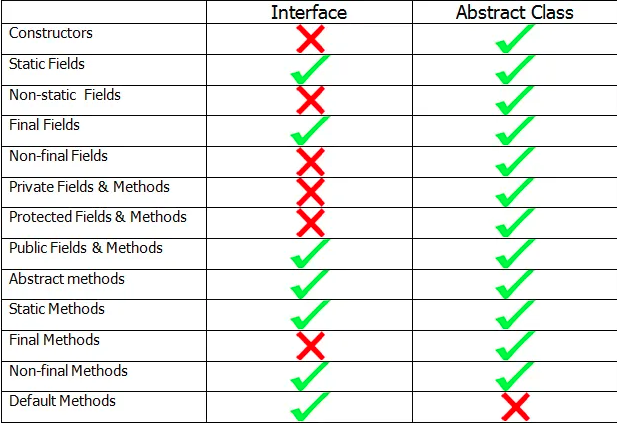

This file is used to record my random brain storm
===============================================================

TODO List - All the finished ones will be moved to separate pages.
---------
* Eclipse MicroProfile
* YAML file - Good to check more about it.
* Design a tennis ball carrier - 
  - It should be Environmental friendly - Using bamboo or wood.
  - It is easy to carry - Can be carried in the tennis bag.
  - It is designed for personal usage - Self-training purpose.
  - It should be afordable - Cheaper than current ones.
  - It can carry tennis balls with it.
  - Initlal design ideas - Plate-like top(IKEA wooden plate), foldable middle part(carry balls with several stick  carrier) - 
* Regex
* Think a way to perfectly support JSON in Java
* URL & URI
* HTTP
  - HTTP/2 - (Java 12)
  - HTTP/3
  - HTTP / handshake
* GraphQL
* Java Memory Model
* More thinking about annotation
* Apache Kafka
* JFrog
* Kotlin - Planned for 2021
* Swift - To finish by 31 May - Summary the programming model difference between SwiftUI and Java MVC
* swagger
* keycloak
* batik
* org.apache.cxf
* jakarta-regexp
* Apache Mina
* Apache Cassandra
* junit-jupiter-engine
* jsoup
* The default eclipse writing check function is not good enough as there is no correctness indication, should enhance it.
* selenium can be used for automation testing - How can it be used to run test without starting browser.
* IntelliJ & Eclipse * 13 March, 2020
* Swift from Stanford University online teaching material.
* JWT - JSON Web Token
* no-sql (MongoDB?)
* cmder & git bash
* Java EE 8 Technology Summary - By 30 May
* MicroProfile (MicroService)
* Dagger
* Docker
* Servlet 4
* Wikitionary - Very interesting open Dictionary - Great for my dictionary project.
* Bean Validation - How to improve the cross-parameter validation.
* JSR 356 - Java API for WebSocket - Server Pash - How is it implemented? - This task should be finished by 24 May
* JSR 365 - CDI 2 and RI Seam - More some more explore about CDI2 and Seam

10 July, 2020
--------------
Eclipse Micro Profile is a worth a more detailed check.

7 July, 2020
-------------
SwiftUI is driving me crazy.

9 July, 2020
-----------
Today is the first day to start AWS 
I plan to get a AWS developer and architect's certificate within one year.

Goal - Get AWS Developer Certificate by the end of this year. (31 Dec)
     - Get AWS Architect Certificate by the middle of 2021. (30 June)
	 
Go Jason, you can do it.

6 July, 2020
-----------
Apache Camel is used as an integration portal - It can go with CDI and spring, used to dispatch request(http, SOAP, JMS) to different service endpoints.

5 July, 2020
-----------
MicroProfile which is released in 2016, focus on Enterprise microservices applications, it is based on CDI, JSON-P, JSON-B and JAX-RS

4 July, 2020
-----------
I read a book about microservice from RedHat - which I have been using for long.
In this book, it illustrate 'Software is eating up the world', mainly due to the free software movement, the cost of using technology is significantly lower,
so it easy to build services using these technologies.

28 Jun, 2020
-----------
Java Security API is a combination of JASPIC, JAAS, JACC - all of which has a long history.

It still lacks the simplicity to be a excellent API.

More work to do for it.

21 Jun, 2020
-----------
Java Security API is very confusing, doesn't seems to be easy to use.
Seems there is more work needed.

18 Jun, 2020
-----------
A JavaEE 8 Technology Stack is added to Github Page.

8 Jun, 2020
-----------
I strongly feel the name of JavaEE should be renamed to Java Module or something like that.
JavaEE which consists of multiple subsystems, is huge - while there is no need to use all of them.
We can easily pick up the one that we use - which will make it a lot easier.
JavaEE is not a good name anymore - EE is basically frightening - Java Module is better (Java 9 has a Module there which will be confusing)

1 Jun, 2020
-----------
It is not surprising if I release a book related to JavaEE technology within 2 years

25 May, 2020
-----------
The more I checked about JavaEE CDI2, the stronger I feel that Spring may not be the most suitable framework for us.
Spring has departed from JavaEE quite far and it is hard for them to come back.
It is reasonable to check more about Seam which is the reference implemention of CDI 2, and use seam's feature in my library

24 May, 2020
------------
JSR-356 - Java API for WebSocket - Summary & Thinking
There are 2 parts of WebSocket Standard, server and client;
First, use WebSocket to connect - Handshake.
Second, communicate using the socket.

It contains: 
Server - which can push message to Client;
Client - Which can push message to Server; It could be Web, or Java or others.

Client is responsible to connect to server.
After connect is established, they will listen to each other.
Encoder/Decoder - Which converts message between Java Object and Text;

15 May, 2020
------------
JSON-B & JSON-P
JSON-P and JSON-B are too small but great library(API)
Before this 2, Jackson, Gson and a banch of other JSON libraries out there.
With Jasn-B and JSON-P as the standard, I feel free and can rely on it now.

It is very easy to use(JSON-B), quite nicely designed.
JSON-P is simple but not enough, because it only provide a stream parse, and lack of facilities as what XPath3 provides.
Luckily, Saxon provides an implementation meets w3c standard.
I still hope there is a JSR for the flexible query using XPath - Needs to check more about whether there is existing JSR in progress - May be I can write one for JCP --

14 May, 2020
------------
Bean Validation 2 is part of JaveEE8
The build in validation for single-parameter is great and easy.
However, the cross-parameter is not very useful, because of 2 reasons:
* The validator needs to know the parameter from context.
* It is not quite straight forward for user experience.

11 May, 2020
------------
SwiftUI can be regarded as the UI framework to Swift.
As UI is a key part for App development, SwiftUI is highly emphsised.
* @State - Bind a View to a varialble, one direction
* @Binding
* @ObjectBinding       

10 May, 2020
-----------
**Clarification of CDI and DI**
CDI/DI - CDI is a java ee specification, while DI is a common term as well as a java specification.
DI is a subset of CDI
CDI 2.0 includes DI 1.0
The main difference is CDI includes lifetime management such as constuct/destroy a class, state, scope management.

Spring only implements DI 1.0 while doesn't implement CDI2, and they will not do it as confirmed by Jouger Holler.
Although Spring doesn't implement JavaEE CDI2, it has all the features of it - life cycle, state, scope management.

9 May,2020
-----------
Summary of JPA Technologies of different version

* JPA consist of 
  - API - which exists in javax.persistence package
  - JPQL - Java Persistence Query Language
  - RRM - Object-Relational Metadata
* JPA 2.0
  - Released in 2009 under JSR_317
  - Support Collection, List and Many-To-One relationship for ORM
  - Criteria API
  - Support Validation
* JPA 2.1
  - Released in 2013 under JSR_338
  - Allow customer converter between Database and Java Object
  - Enhance JPQL/Criteria for sub-query, join ON, generic DB function and TREAT(?? TODO)
  - Stored Procedures
* JPA 2.2
  - Released in 2017 under JSR_338
  - CDI support for AttributeConverter
  - Some annotation become @Repeatalbe (such as NamedQuery)
  - Support Java 8 new Data Time
  - Allow Stream a query Result

3 May, 2020
--------------
I strongly feel the limitation of **define type** first before using it both in programing language & relational database.
In programming language, define type first is unconvenient, as it may be used just once. Similarly, in Database, define the table before using it is a limitation as well.
Probably good to have a look at no-sql DB system like MongoDB.

2 May, 2020
--------------
Comparision between Java & Swift
* Declare varialb & constants
  - It is encouraged to declare var without type - This is a convenient feature and used in Java 11
  - let keyword is used as final to java and const to c++
  -  It is not mandatory to add comment to end a line.
  - In case of multiple line code, compiler needs to be smart to recognise whether it is one or multiple line - Seems swift is doing well.
* Float & Double
  - Sadly, float is still kept, it should be removed as it bring more problems than benefit.
* typealias
  - it is a good feature as it is useful in many cases.
  - type alias is supported in oracle db which is very useful.
* control flow
  - swift only allow boolean to be the condition which is better than Java which allows confusing int(0 is false, 1 or other is true).
  - if and while can accept optional, if optional has a value then, it can even return the value to an temporary var; if convert fails then go to false - very interesting.
           The idea is that if and while is success(true)/failure(false) based, not value bases 1(true) 0(false)
* ?? is short cut of a != nil ? a : b - Good feature as it is used a lot.
* ... and ..<
  - Full-Closed and Half-Closed
  - In Java, there is IntStream.rangeClosed() & range()
* optional (? and !)
  - swift uses ? for an optional value, Java use keyword Optional as a wrapper.
* for loop
  - swift slightly improves by allowing ..< and ..
  - Java's foreach loop is good enough with new var.
* text block
  - both Swift and Java(13) support """ as the text block symbol.
  - Java treat everything inside text block as string, while Swift will ignore some space due to format.
* Single Interpolation
  - Swift support variable within a string directly by \(vaiable) and support calculation within it.
  - I would think $variable is a more natural way than \(, why they use \(?? Is it because $ as a string is used more frequently or because it has to have a space to separate the variable? Maybe both.
* Array
  - The Array of Swift is actually the combination of Array, ArrayList and ListUtil of Java
* Dictionary
  - Dictionary of Swift is HashMap of Java.
  - The key of Dictionary must implement Hashable Interface, this is very good, as in Java, there is no mandatory must just a coding convention to implement hash() and equals()
  - In Java, it is still possible to introduce this rule - Create an interface, make key Hashable, and give a default implementation, implement this interface for String, Integer.
        {code}
            interface Hashable {
                default boolean uniqueHash(){return false;} * More consideration needed to combine hash() and equals() method
            }
        {code}
* function in swift is the first level member as class and struct.
  - In Java 8, functional interface has much releases of Java to be updated with functional programming.
  - It proves pure OO is not idea, function is still simple and easy to use. As print() in Swift is simpler than System.out.println()
  - Pass funtion as a parameter seems powerful - Didn't see much use by far.
* Constructor - Swift use init & deinit as constructor - I am neutral of this difference
  - There is no deinit in Java - As JVM will do garbage collection automatically.
  - Using init seems to be good, as every class can use the same name, and it doesn't need to declare return type.
* Getter & Setter - Swift beautifully combines the famous getter & setter to its associated variable, and it is implicitly accessed by dot * Interesting feature.
  - get, set, willSet & didSet are good feature, still not simple enough - There is potential room to simplify them further?
  - I am not quite comfortable with the variable to be 'public' by default - It could be because of legacy from Object-C(In C++ struct, variable are public default)
* Enum 
  - Enumerattions can initilize int or double from the starting value.
  - Enum could use variant parameters.
*  Protocols - protocol to Swift is interface to Java
*  struct & class
  - Swift uses both Struct & Class, using struct as value type while class as reference type.
  - I don't see much benefit of struct so far, as value & reference type is a legacy feature from C++(probably Object-C as well), it is a low-level concept.
  - Seems it is not necessary to keep struct - I would think get rid of struct and keep class as what Java did is better.
* extension
  - It is quite a surprise for me of due to 
* error handling
  - try? is a real joy for me as I really hate try catch block in Java, the best programme should run from the first line to the end with no noodling-jumping
  - It is great to convert the result automatically and get the result so succinctly.

28 April, 2020
--------------
I have tried swift for several weeks, and it proves to be an interesting & expressive language.
After finishing the online material from Apple, I decide to read 'The Swift Programming Language(Swift 5.2)'
The outcome should be:
* A comprehensive compration between Jave & Swift, thus can get a deep understanding of the new generation programming language
* A simple application - Dictionary which should meet my daily usage.
This book should be finished by the end of May.

18 April, 2020
--------------
Git bash is a nice tool which simulate linux command and satisfying performance.
However,  git bash doesn't support screen split - This is a much needed feature for me.
Hence, I made some investigation and finally find **cmder** is a perfect tool.
* It supports split screen vertically or horizontally.
* It includes a Git Bash and uses the latest Git Core(2.24.1), and has a much attractive UI - The font and color is great.
* Maybe I should suggest the whole company to use it.

13 April, 2020
--------------
Swift is a nice language, with modern features which Java can learn.
Seems like the third generation (C, C++ ->Java, C# -> Swift, Kotlin) introduces a much natural way of writing programe.
Java is simply and nice, with poor UI though.
Swift is great at making the UI development so attractive, especially for Annimation part.
Conclusion - Spending more time on it and think how to improve Java using features from Swift.

29 March, 2020
-----------
Selenium is good for web test, but there is big limitation about functions such as 'Save As'
The reason is that 'Save As' function are system level functions, are for security reason, browser(Chrome & Firefox) didn't provide a direct simulation.

13 March, 2020
------------
**Eclipse & IntelliJ IDEA 1**
I have using Eclipse from 2010, and IntelliJ for 1 week.
As recommended by ex-fellow from Alibaba and Architecture from my current company, I decided to try IntelliJ IDEA.
By far, I have managed to run our product. 
Currently still in the stage of mastering useful hotkey of IntelliJ.
I haven't notice things that are declared by other 'Far Better' - seems all the things IntelliJ can do, eclipse do it well, as Eclipse is just community driven, while IntelliJ is developed by a company, so I doubt is it just because IntelliJ put more money on advertisement?
There are many comments against Eclipse which seems they compare a old eclipse version or that they are using eclipse instead of Eclipse Java EE version.

Eclipse does a pretty good job - Really great design - plugin driven framework.

Eclipse used to be unstable, but now it is very stable.
There are 2 points which seems IntelliJ is better:
* Debug variable value is more direct.
* Using Vim-Simulator as the editor is good - (No it is bad now, nightmare)
	
I will try some more time for IntelliJ and then decide to whether to keep on eclipse or totally switch to IntelliJ.

**Eclipse & IntelliJ IDEA 2** Update on 15 May:
I fell in love with IntelliJ now
The original issue is sourced from Vim-Simulator - This is a disaster.
Although Vi is very good, the Vim-Simulaor editor is bad experience:
* By default, it is read-only mode.
* Many hotkey are conflicted with the System which is very headache.

It is strongly recommended to remove Vim-Simulator from IntelliJ.

Version 2020.1 is a perfect version.
The main advantages are:
* The default editor is nice to use.
* The hotkeys are more useful than eclipse.
* The search function is much better.
* Parameter indication is very useful.
* Debug time value is easy to show.
* Dictionary is better.

The main disadvantage are:
* The default builder sometimes failed to build the project - Properties files are not build - Not sure why - The workaroud is to use maven(or maven plugin) to rebuild it.
* The maven plugin is good, but is not treated as the first-class member as what Eclipse does.
* It consumes more memory than Eclipse.

8 March, 2020
------------
**Rendering HTML** is kind of difficult, the best way for now is relying on a browser to do it.
HTML Renders available in Java:
* CSSBox 
  - HTML/CSS rendering engine.
  - It can render css and html only.
  - Doesn't support JS.
* JxBrowser
  - It contains a browser inside a Java Swing application.
  - Utilize the browser to render web within UI.
  - Doesn't support headless mode.
* HtmlUnit 
  - A pure Java Engine.
  - Headless engine.
* Headless Chrome
  - Chrome browser support 

6 March, 2020
------------
As a summary of the work in the past month - Raumati Branch Picture
(Chart is drawn with email sent out)

1 March, 2020
------------
The key design difference between Java, NodeJS, Python
* widefly
* class loader of java

28 Feb, 2020
-----------
There is a dom4j issue today, finally found it is caused by maven dependency scope:
There are 3 **classpaths** in maven: compile, test and runtime, there are different **scopes** and availability:
* compile - it is default scope, 'compile' scope dependencies are available for all 3 classpaths - transitive.
* provided - 'provided' scope dependencies are available compile & test classpath only, not available in runtime classpath - not transitive.
* runtime - 'runtime' scope dependencies are available in runtime and test classpath, but not available in compile classpath - transitive
* test - 'test' scope dependencies are available on test classpath only - not transitive.

24 Feb, 2020
------------
**Java Module** (Java 9) provides a package level encapsulation.
It is useful for controlling the visibility of classes hence further decouple modules.
* It is useful for framework like JDK, Apache and SpringFramework which has a limited classes (thousands or 10s of thousands)
* Encapsulation of Internal Packages
* Startup Detection of missing modules - Instead of runtime detection.
* It is easy to read code in module within Eclipse.
* It is a good practice to encourage developers to think more carefully when creating new packages.

Whether it is useful for general java system is still questionable for 2 reasons:
* For back capacity, it only existing code by allowing all to be exposed as a default behavior.
* It is useful when the whole system is using module.
* It doesn't have version control.

Useful tools for Java Module
* Recommended module name is the root Java package contained in the module - reversed domain name - for example, com.bravura, org.jason
* java --list-modules  == This is used to list all modules

18 Feb, 2020
------------

17 Feb, 2020
------------
**Annotation** is a great feature, gain success in enterprise application development, the most successful usage of annotation are:
* Scenarios which requires data transformation between java and other type systems - like database, XML - to avoid extra mapping.
* Scenarios which require extra configuration to link the code and intend - such as web restful URL mapping.
* Scenarios which rely on code convention to finish a function - such as unit test.
* Scenarios which needs extra code ensure an common function, which has been features in other languages such as @Nonnull @Nullable
	 
In core Java, seems all the mandatory annotations are still processed at compile time, such as Override.
Runtime level annotations are still servers as an explanation instead of mandatory. Such as @Nonnull, @Nullable

However, there are a lot of objections in java community - Anti pattern. 

14 Feb, 2020
------------
**JxBrowser** is a library that allows web technology into Java Swing application, so that HTLM, CSS and JS can work in Java UI application.
It uses v8 js engine(chrome engine) to drive the web.
A pretty cool technology.

12 Feb, 2020
------------
Annotation 
* JSR-175
* JSR-269
* JSR-305

Is it possible to - TODO

09 Feb, 2020
------------
* **HTTP/2** is released in 2015 and 
  - HTTP, HTTP/2, HTTP/3
  - Parse HTTP page in Java
* GraphQL
* Java Memory Model
* Is it possible to turn on runtime check and fail if exception occur for JVM? for example Nonnull.
* keycloak - what is used for? theory behind it.
* ANTLR is an interesting tool, needs more investigation.
* Worth a whole check about all different JSRs.
* ASM library is used to modify java class file.
* Spriting is a technical to merge small images into a big one and then extract them out by small one.

07 Feb, 2020
------------
ScriptEngine, JavaCompiler

06 Feb, 2020
------------
Several Locale related classes
* Locale * country & language
* Currency - getInstance
* NumberFormat -  getCurrencyInstance, getNumberInstance, getIntegerInstance, getPercentInstance.
* Collator - Collator.getInstance - localized comparator.
* ResourceBundle - getBundle - deal with resource files automatically according to 

05 Feb, 2020
------------
**Java Network**
* Socket
  - Socket is quite fundamental level
  - Socket, ServerSocket together with InputStream OutputStream
* Connection
  - Connection Level is build on top of Socket.
  - URL, URLConnection, HttpURLConnection
* HttpClient
  - From Java 9, complete in Java 11
  - Support Http/2
  - Specially designed for HTTP
  - HttpClient, HttpRequest, HttpResponse, HttpRequest.BodyPublisher, HttpRequest.BodyPublishers

Common facility 
*  InetAddress - Convert IP address and domain name

04 Feb, 2020
------------
**Git** Advanced:
* git symbolic-ref refs/heads/trunk refs/heads/master * Alias a branch name
* git symbolic-ref -d refs/heads/trunk                -- Do not use git branch -d to delete a symbolic * Delete a symbolic created above: 
* git merge-base branch_one branch_two                -- Find a common base of 2 branches(or commits)
* git diff commit1 commit2 --name-only                -- Find difference between commits, not include the first commit, to include use commit1^()
* git log * folder                                    -- Logs of files within a folder 
* git cherry-pick commit1^..commit2                   -- pick all commits from commit1 to commit2

03 Feb, 2020
------------
**Data sharing** technology in Java
There are 3 different level of Data exchange technologies:
Information Exchange
* CPU Level - CPU Cache - Can be regarded the same as Memory Level data share.
* Memory Level - Variable (Object) 
  - Memory Level is more efficient than efficient than Disc and Internet Level due to speed.
  - All disc level & Internet Level information will be exchanged via its own memory.
* Disc Level - File, Database
* Internet Level - WebService, or Rest Service

Different processes(programmes) can share data through Disc Level and Internet Level.
Different threads within the same process can share data through Memory Level, Disc level and Internet level.

As Memory Level is far more efficient than Disc Level and Internet Level, thus provide the

30 Jan, 2020
------------
Why are we still using abstract class??
This is the comparison of **interface & abstract class**
* Interface can only has public static final variables, while abstract class can have non-static var
* Interface can only has public methods, while abstract class can have all 4 types.
* Interface cannot have final methods while abstract class can have.
* Interface cannot have constructor while abstract class could have(cannot instance one though).

So there are 2 type of coding philosophy:
* Using Abstract class to do everything (java.util.Calendar, java.time.Clock):
  - Create a concrete classes internally (through factory methods Calendar)
  - provide facilities(static class)
  - provide internal implementation through internal class
* Using Interface and a final tool class (java.nio.Path, java.nio.Paths)
  - Interface provide factory method to construct concrete instance from default configuration or system. 
  - Provide common interface methods.
  - Provide default methods.
  - Tool class is just provide some convenient methods.

From my mind, if I redesign a new language, abstract class should be removed.

29 Jan, 2020
------------
Summary the bad design of old **java Date** * TODO
*  Date is mutable, which makes it not safe.
* Date constructor Date(year, month, day), the year is actually (year - 1900), month is (month - 1)
  - Calendar
  - 

New time API: java.time
LocalDate, LocalTime, Period, Duration, ZonedDateTime, DateTime, Instant, DateTimeFormatter, ZoneId, Clock
TemporalAdjusters. TemporalAmount, TemporalAdjuster -- Needs more in deep check -- TODO

28 Jan, 2020
------------
Java DB project is directly from Apache Derby, it was originally contained within JDK 6 and removed from JDK 8.
Apache Derby is actively developed and is a embedded DB that is pure Java, support JDBC and support standard SQL.

HSQLDB is another embedded DB system, which seems gain more popularity(Used by LibreOffice and OpenOffice).
* HSQLDB support JDBC 4 and closely to SQL2011 standard.
* HSQLDB support table level locking.
* jdbc:hsqldb:hsql://<HOST>/testdb   org.hsqldb.jdbc.JDBCDriver

27 Jan, 2020
------------
There are 4 types of **JDBC Driver**
* Type 1 
  - JDBC-ODBC Bridge Driver
  - It converts JDBC to ODBC call 
  - Not recommended to use
* Type 2 
  - JDBC-Native API Driver
  - It is partly java, and converts to native code. 
  - jdbc:oracle:oci is this type
  - Not recommended
* Type 3 
  - JDBC-Network Protocol Driver
  - Pure Java implementation
  - Client code just needs to use standard Java, all the implementation is within server which connects to DB
  - Partly Recommended - If there is no type 4 available, then use type 3
* Type 4
  - JDBC-Database Protocol Driver
  - Also called thin driver
  - Pure Java implementation
  - MySQL support it: jdbc:mysql://<HOST>:<PORT>/<DATABASE_NAME>     com.mysql.jdbc.Driver
  - Oracle support it: jdbc:oracle:thin@<HOST>:<PORT>:<DATABASE_NAME>     oracle.jdbc.driver.OracleDriver
  - Recommended - Most DB system supports this thin type, though some doesn't contain thin in the name

24 Jan, 2020
------------
**Common XML** libraries of Java EE
* JDK - DOM SAX StAX - JDK provides Reading and writing XML files through DOM, SAX and StAX, default one is Apache xerces inside.
  - XSLT - JDK provide TransformerFactory, the default one is Apache Xalan, but could be modified to Saxon.
* JAXB - Java Architecture for XML Binding
  - It deals with mapping between Java classes and XML files
  - It has been removed from JDK from Java11, and one popular implementation is com.sun.xml.bind-jaxb-impl (JAXBContext Unmarshaller, Marshaller)
* Xalan - Apache Xalan Project
  - implements XLST 1.0 and XPath1.0
* Saxon - Implements XLST 2.0 3.x and XPath 2.0, 3.x, XQuery 3.x

23 Jan, 2020
------------
**DOM** is a tree structure parsing XML, there is another way: Streaming XML SAX and StAX

* SAX - Simple API for XML, also known as Streaming XML.
  - An event-driven online algorithm for parsing XML documents.
  - SAX parsers operate on each piece of the XML document sequentially.
  - SAX is Part of JDK(SAXParseFactory)
* StAX - Streaming API for XML
  - It is originated from Java Community, not managed by W3C.
  - It is similar to SAX, but will pull information itself, not like SAX which push data through handle.
  - StAX is easier for programming purpose.
  - StAX is Part of JDK(XMLInputFactory)

22 Jan, 2020
------------
**XML** has quite a few technologies around it  - XQuery, Xpath, Dom, SAX, XSL, XSLT, JAXB, dtd, xsd,
The following technologies are around XML and managed by W3C

* XML - eXtensible Markup Language - 
  - Simple, flexible text format derived from SGML
  - Originally designed to meet the challenges of large-scale electronic publishing
  - Also playing an increasingly important role in the exchange of a wide variety of data on the Web and elsewhere
  - Managed by W3C
  		 
* DOM - Document Object Model 
  - A programming API for HTML and XML documents
  - Managed by W3C
		 
* XSL - eXtensible Stylesheet Language for XML
  - A family of recommendations for defining XML document transformation and presentation including XSLT, XPath, XSL-FO
         
* XSLT - eXtensible Stylesheet Language Transformations
  - A language for transforming XML documents into other XML documents or other formats such as HTML for web pages, plain text or XSL Formatting Objects
  - XSLT uses XPath to identify subsets of the source document tree and perform calculations
  - XSLT 1.0 support basic operations, XSLT 2.0 support date, time and regex for String, XSLT 3.0 support Streaming XML
  - Managed by W3C
		  
* XSD - XML Schema Definition 
  - Validate the structure of another XML
  - Managed by W3C
		  
* XPath - XML Path Language.
  - A query language for selecting nodes from an XML document.
  - May also be used to compute values From XML document.
  - XPath 2.0 is built around the XQuery and XDM, XPath 3.0 support functions as first class value., XPath 3.1 add map and array type so to support JSON
  - Managed by W3C		   
  
* XQuery - XML Query
  - XQuery is the language to query XML.
  - XQuery is a standardized language for combining documents, databases and Web pages
  - XQuery is a query and functional programming language that queries and transforms collections of structured and unstructured data such as XML, JSON and even database.
  - Provide flexible query facilities to extract data from real and virtual documents on the World Wide Web.
  - XQuery is to XML what SQL to databases.
  - Managed by W3C
  		    
* XDM - XQuery and XPath Data Model -- TODO
  - Managed by W3C

21 Jan, 2020
------------
Tree Parser such as DOM parse(include Document, DocumentBuilder, DocumentBuilderFactory)treat XML as a tree structure and is suitable for most XML analysis.
Streaming Parser such as SAX Parser and StAX parser generate event when reading the file, so it is suitable for big and simple XML analysis.

19 Jan, 2020
------------
FileChannel is used for memory-mapping, which can be used

18 Jan, 2020
------------
Regex is very powerful and I used in some scenarios during daily work.
However, seems I never get a point to fully understand it.
It is time now - Master Regex in one Week.

17 Jan, 2020
------------
CyclicBarrier is similar to CountdownLatch, but can be used repeatedly once released.

15 Jan, 2020
------------
Serializable interface
There is no method in this interface, and if to modify the default serializable method, we need to provide readObject and writeObject method, and are called secretly!!!
There is a benefit: If an Object implements Serializable, then it is easy to implements the Clone method using ByteArrayInputStream and ByteArrayOutputStream.

Clonable interface 
Clonable interface is ridiculous design, there is no interface, but once you implements it, we need to override the clone() method of Object - Bad Design !!!
What we should do is to remove the clone method in Object class and add it to Clonable.

Java needs to maintain backward compatibility so there is no easy way to change fundamental class Object.

14 Jan, 2020
------------
ThreadLocal seems a bad design, it is best not use it.
Stream - groupBy is a very useful method together with Collector
		reduce can be used when there is no direct function of stream, but it should be a second choice as the function is not self-explaining.

Parallel Stream is suitable for most cases if there is no sequence required - it is not used that much only because it is fast enough - Stream is used for simple calculation only.

13 Jan, 2020
------------
Today I started "Core Java Volume II - Advanced Features", and expected to fully finish it within 6 weeks from day.
This week, I plan to finish the first chapter - About Stream.

12 Jan, 2020
------------
Restrictions have been used in **Hibernate** - not too bad though - TODO

11 Jan, 2020
------------
I have created class which is very useful for Parameter Check and used to enhance Objects, functions should be:
* requireNonnull, requireNull, requireEquals, requireNotEquals, requireSameDay.

It should be used for Parameter and result check of a call.
I considered several names for it, Parameters and Requirements
* Parameters would indicate it is used for Parameters check only; 
* Requirements seem better, but would be duplicate to the function name;
* Restrictions could be best 

10 Feb, 2019
------------
Gson and Jackson can both be used to parse **Json** String & Objects  - What is the difference?

These days, I use GraphQL as it is required by workflow innovation project. GraphQL seems promising, however, there is no utility 
to convert between JSON string and GraphQL query - Is it possible to write a utility?

When I read Gson, I noticed it uses Type, and I noticed interface have implicitly public method from Object, although it does not inherit from Object.
Why is it designed this way?
