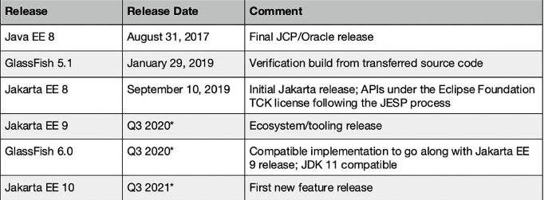

# JakartaEE 8,9, 10 Release Plan

| JavaEE Release        | Release Date           | Comment|
| ------------- |:-------------:| -----:|
|JakartaEE 10|Q3 2021 | First new feature release|
|JakartaEE 9|Q3 2020 |Ecosystem/tooling release, JavaSE 11, GlassFish 6|
|JakartaEE 8|Sep 2019 |Initial Jakarta release; API under the Eclipse Foundataion TCK license following the JESP process|
|JavaEE 8|Sep 2017|Final JCP/Oracle release, GlassFish 5|
|JavaEE 7| May 2013||
|JavaEE 6|Dec 2009||
|JavaEE 5|May 2006||
|JavaEE 1.4|Nov 2003||
|JavaEE 1.3|Sep 2001||
|JavaEE 1.2|Dec 1999||

| JavaSE Release  | Release Date           | Comment|
| ------------- |:-------------:| -----:|
|JavaSE 14|Mar 2020||
|JavaSE 13|Sep 2019||
|JavaSE 12|Mar 2019||
|JavaSE 11|Sep 2018||
|JavaSE 10|Mar 2018||
|JavaSE 9|Sep 2017||
|JavaSE 8|Mar 2014||
|JavaSE 7|July 2011||
|JavaSE 6|Dec 2006||
|J2SE 5|Sep 2004||
|J2SE 1.4|Feb 2002||
|J2SE 1.3|May 2000||
|J2SE 1.2|Dec 1998||
|JDK 1.1|Feb 1997||
|JDK 1.0|Jan, 1996||

|Specification	|Java EE 6	|Java EE 7	|Java EE 8|
| ------------- |:-------------:| -----:|:-------------:|
|Servlet	|3.0	|3.1	|4.0|
|JavaServer Pages (JSP)|	2.2|	2.3|	2.3|
|Unified Expression Language (EL)|	2.2|	3.0|	3.0|
|Debugging Support for Other Languages	|1.0	|1.0	|1.0|
|JavaServer Pages Standard Tag Library (JSTL)|	1.2|	1.2|	1.2|
|JavaServer Faces (JSF)|2.0	|2.2	|2.3|
|Java API for RESTful Web Services (JAX-RS)	|1.1	|2.0	|2.1|
|Java API for WebSocket (WebSocket)	|n/a	|1.0	|1.1|
|Java API for JSON Processing (JSON-P)	|n/a	|1.0	|1.1|
|Common Annotations for the Java Platform (JSR-250)	|1.1	|1.2	|1.3|
|Enterprise JavaBeans (EJB)	|3.1 Lite	|3.2 Lite	|3.2|
|Java Transaction API (JTA)	|1.1	|1.2	|1.2|
|Java Persistence API (JPA)	|2.0	|2.1	|2.2|
|Bean Validation	|1.0	|1.1	|2.0|
|Managed Beans	|1.0	|1.0	|1.0|
|Interceptors	|1.1	|1.2	|1.2|
|Contexts and Dependency Injection for the Java EE Platform	|1.0	|1.1	|2.0|
|Dependency Injection for Java	|1.0	|1.0	|1.0|

